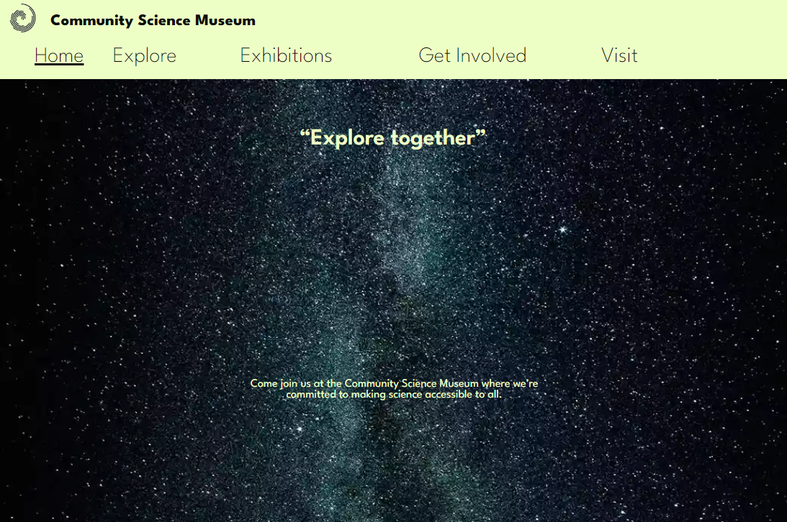

### Community Science Museum - Semester project

---

The project was to design, and ultimately create a museum webpage designed using html, css, and later javascript.

## Description

The site is about a community driven museum.
We were given the task to create their webpage. It is a museum for kids, and also families with kids.
It has a homepage, an explore section, exhibitions and also a involvement section and visit page.

- Responsive
- WCAG
- Easy to use

## Built with

- HTML
- CSS

## Contact
- [Linkedin](https://www.linkedin.com/in/ken-thore-bøeng-b2b1b3ba/)
